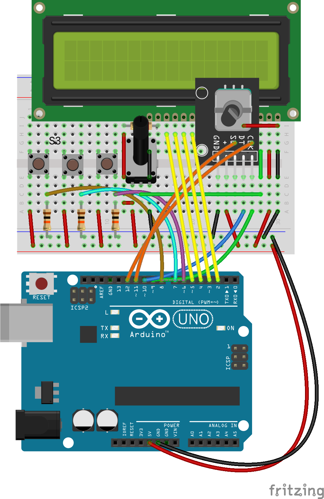

# Cable Measure
## An [Arduino](https://www.arduino.cc) based device to measure cable from a drum.  

Use cableMeasure.ino to build a circuit from components, or use cableMeasureVMA203.ino if using the [Velleman VMA203](https://www.velleman.eu/products/view/?id=435510) shield.

The pin defined as __targetLengthIndicator__ will go high whenever a mulitple of the target length is measured.

Adjust __C__ to be the length measured for one complete rotation of the measuring device.

Adjust __N__ to reflect the number of clock pulses from one complete revolution of the encoder.

The display is fixed to an accuary on of 0.1 measurement unit.

Both version were tested using this [rotary encoder module](https://www.epitran.it/ebayDrive/datasheet/25.pdf).

## __VMA203 version__

Using the [Velleman VMA203](https://www.velleman.eu/products/view/?id=435510) shield the buttons will function as follows:

| Button    | Description |
| ----------- | ----------- |
| SELECT| Reset measured length|
| LEFT| Decrease target length by 10|
| RIGHT| Increase target length by 10|
| UP|Increase target length by 1 |
| DOWN| Decrease target length by 1|

Here is the [schematic](cableMeasureVMA203/vma203_schematic.png) of the [Velleman VMA203](https://www.velleman.eu/products/view/?id=435510)

## __Component Version__

| Button    | Description |
| ----------- | ----------- |
| S1| Decrease target length by 1|
| S2| Increase target length by 1|
| S3| Reset measured length|

### Schematic

### Breadboard layout

William Addison 210308

